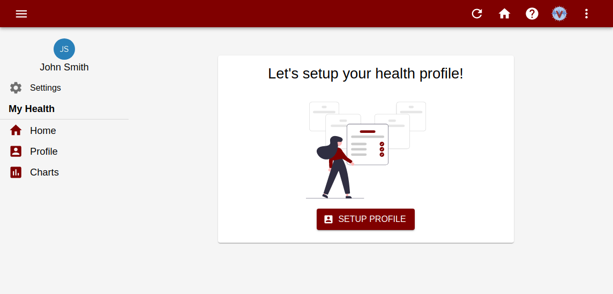
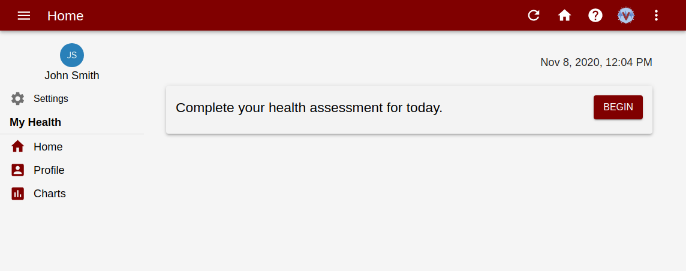
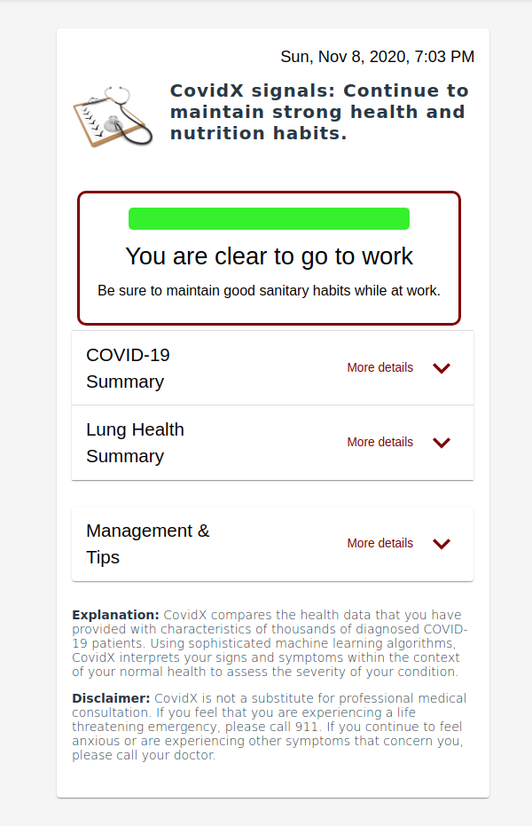

CovidX allows you to easily to self-monitor your symptoms and signs, catch infections early, and take control of your overall health.

## Signing Up

You can sign-up to your organization through two methods:

- Email invite
- Open sign-up link

Please consult your organization's admins on how to sign-up.

## Setting up your health profile

After creating your account, you will need to setup your health profile:

## Taking your first assessment

## Receiving your assessment results

Once you complete the questionnaire, we'll leverage our machine-learning algorithms to provide you with personalized health recommendations:

