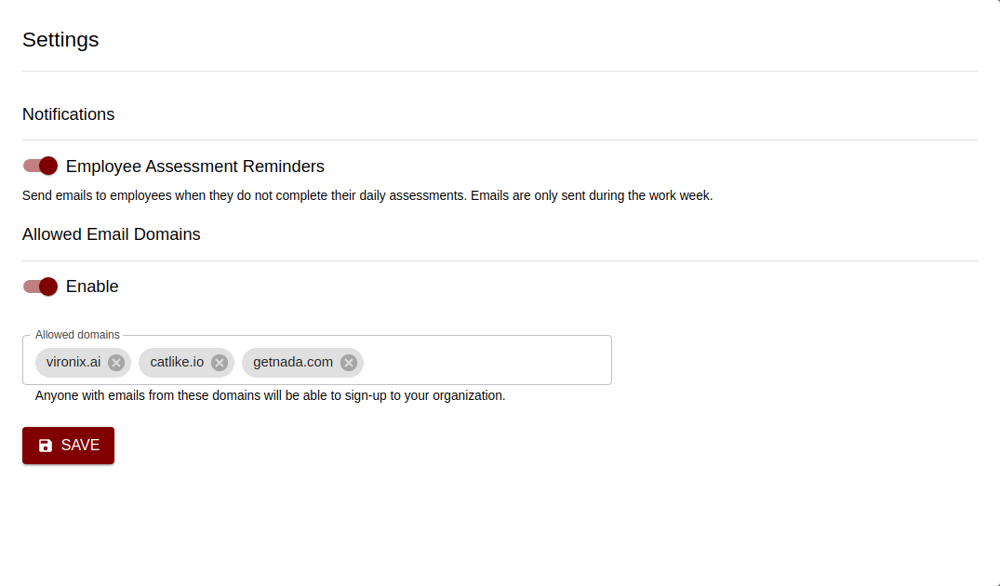

## Overview

Add members to your organization so that they can complete their daily assessment's and get automatically placed within the organization's reports.

## Adding members by email

As an `admin`, you can invite member's by their email address:

- Go to members tab
- Press the `Invite Member` button
- Enter the user's name and email address
- The user will receive an invite email with a link to join the organization.

## Allowed email domains

A faster way to enroll members into your organization is by enabled email domain signups. Anyone with an email from your whitelisted domain can sign-up into your organization.
As an `admin`:

- Go to `Settings`
- Click the `Settings` tab under your organization
- Enable the toggle button under `Allowed email domains`
- Add an email domain in the domain field. You only need to add the domain name. For example: `vironix.ai`

