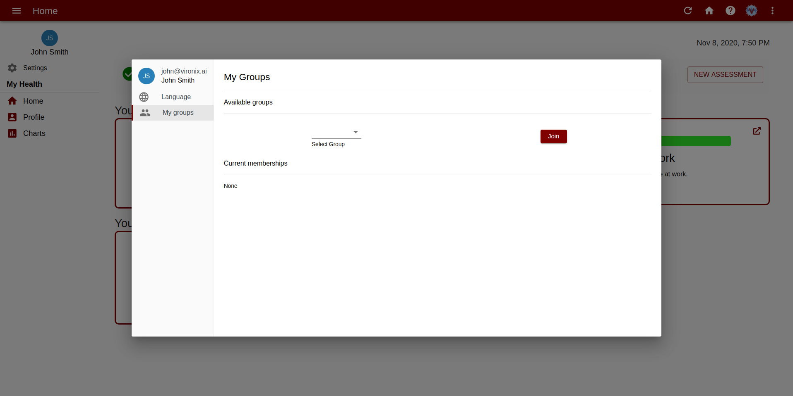

## Overview

Groups allow you to organize your members into monitoring segments. CovidX will automatically begin to generate reports based on your groups. You can assign other members as managers to oversee the group.

## Creating a group

Only users with `admin` role or above can create a group. Groups can be created through the group page.

## Adding members to a group

There are two ways to add members to a group

1. Adding users as an admin
2. Open-access groups

### Manually adding members to groups

Admins can add members to a group through the groups main.

Additionally, admins can bulk add members into groups through the members page.

### Open access-groups

Admins can set groups to have open-access. This will allow any member to join the groups through their settings menu. Users can only join with the `member` role.

## Group roles

1. **Member**

   Members of a group will have their assessments & compliance metrics placed as part of the group.

2. **Manager**

   These users can access the reports of the group.
